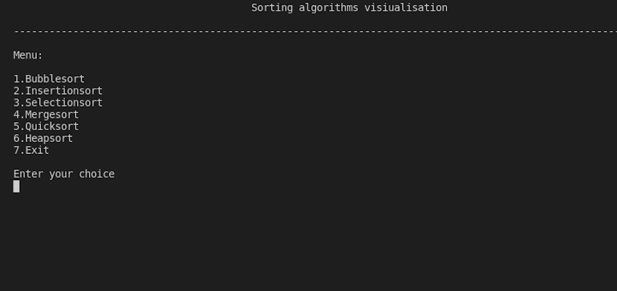

# Sorting-algorithm-Visualiser

This project helps in visualizing 6 different sorting algorithms which are\
1.Bubble sort.\
2.Insertion sort.\
3.Selection sort.\
4.Merge sort.\
5.Quick sort.\
6.Heap sort.

It asks to input a set of randomly arranged positive integers and allow you to choose any one of the above algorithm.Then by the use of horizontal histogram,it shows each step of the algorithm with a time delay of 500ms.\

When you run the program,you need to input total number of elements.Then you need to enter each element one by one.

A sample example:

Then a menu pops up asking you to choose one of the above algorithm

Enter the number in front of the algorithm you want to choose.Then the program executes by showing each step with some delay.

When the algorithm terminates,it will ask whether to try a different algorithm(continue) for the same order of numbers or to exit.You have to choose accordingly.

THAT'S IT!!!
